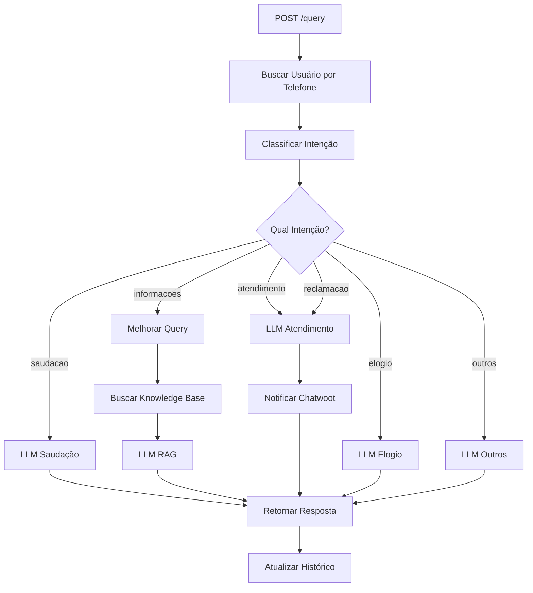

# EcoDrive Query API

API REST desenvolvida em Python para processar queries de clientes da EcoDrive, convertendo o flow do Dify em um serviço standalone.

## 📋 Índice

- [Visão Geral](#visão-geral)
- [Arquitetura](#arquitetura)
- [Funcionalidades](#funcionalidades)
- [Tecnologias](#tecnologias)
- [Pré-requisitos](#pré-requisitos)
- [Instalação](#instalação)
- [Configuração](#configuração)
- [Uso](#uso)
- [Endpoints](#endpoints)
- [Fluxo de Processamento](#fluxo-de-processamento)
- [Docker](#docker)
- [Desenvolvimento](#desenvolvimento)
- [Integração com Knowledge Base](#integração-com-knowledge-base)
- [Alternativa com Langflow](#alternativa-com-langflow)
- [Troubleshooting](#troubleshooting)

## 🎯 Visão Geral

Esta API converte o workflow do Dify da EcoDrive em um serviço Python independente com FastAPI. O sistema processa queries de clientes, classifica intenções e fornece respostas contextualizadas através de diferentes modelos LLM.

**Fluxo Original (Dify):**
```
Input (phone + query) → User Lookup → Intent Classification → LLM Routing → Response
```

**Implementação (FastAPI):**
```python
POST /query
{
  "query": "Quanto custa o patinete X2?",
  "phone": "+56912345678"
}

→ Response
{
  "answer": "Resposta personalizada...",
  "intent": "informacoes",
  "conversation_id": "uuid"
}
```

## 🏗️ Arquitetura

```
┌─────────────────────────────────────────────────────────────┐
│                      EcoDrive Query API                      │
├─────────────────────────────────────────────────────────────┤
│                                                               │
│  ┌──────────────┐      ┌──────────────────────────────┐    │
│  │   FastAPI    │─────▶│   External API Service       │    │
│  │  (main.py)   │      │  - User lookup by phone      │    │
│  └──────┬───────┘      │  - Chatwoot notifications    │    │
│         │              └──────────────────────────────┘    │
│         │                                                   │
│         ├─────────────▶┌──────────────────────────────┐    │
│         │              │   LLM Service (OpenAI)       │    │
│         │              │  - Intent classification     │    │
│         │              │  - Greeting responses        │    │
│         │              │  - Customer service          │    │
│         │              │  - Query improvement         │    │
│         │              └──────────────────────────────┘    │
│         │                                                   │
│         └─────────────▶┌──────────────────────────────┐    │
│                        │   RAG Service                │    │
│                        │  - Context retrieval         │    │
│                        │  - Knowledge base search     │    │
│                        │  - Response generation       │    │
│                        └──────────────────────────────┘    │
│                                                               │
└─────────────────────────────────────────────────────────────┘
         │                          │                  │
         ▼                          ▼                  ▼
  ┌─────────────┐          ┌─────────────┐    ┌─────────────┐
  │ External    │          │   OpenAI    │    │   Cohere    │
  │ RAG API     │          │     API     │    │ (Reranking) │
  └─────────────┘          └─────────────┘    └─────────────┘
```

## ✨ Funcionalidades

### Classificação de Intenção
O sistema classifica automaticamente a query do usuário em:
- **saudacao**: Cumprimentos e saudações
- **informacoes**: Perguntas sobre produtos e informações
- **atendimento**: Solicitações de atendimento humano
- **reclamacao**: Reclamações e problemas
- **elogio**: Elogios e feedback positivo
- **outros**: Queries fora do escopo

### Roteamento Inteligente
Baseado na intenção classificada, a query é roteada para:
- **LLM de Saudação**: Respostas calorosas e apresentação
- **LLM RAG**: Busca em knowledge base para informações
- **LLM de Atendimento**: Encaminhamento para humanos
- **LLM de Elogio**: Agradecimentos
- **LLM Outros**: Redirecionamento educado

### Contexto de Conversa
- Mantém histórico de conversação
- Considera contexto em respostas
- Suporta múltiplas conversas simultâneas

### Integrações Externas
- Busca de dados de usuário por telefone
- Notificações para Chatwoot
- Knowledge base retrieval (RAG)

## 🛠️ Tecnologias

- **FastAPI**: Framework web moderno e rápido
- **Pydantic**: Validação de dados e settings
- **OpenAI**: Modelos LLM (GPT-3.5-turbo, o3-mini)
- **Cohere**: Reranking de resultados (opcional)
- **HTTPX**: Cliente HTTP assíncrono
- **Uvicorn**: Servidor ASGI
- **Docker**: Containerização

## 📋 Pré-requisitos

- Python 3.11+
- Docker e Docker Compose (opcional)
- OpenAI API Key
- Cohere API Key (opcional, para reranking)
- Acesso à API externa RAG (configurada no Dify)

## 🚀 Instalação

### Opção 1: Instalação Local

```bash
# Clone o repositório
git clone https://github.com/AIMILV1-commits/Difytest.git
cd Difytest

# Crie um ambiente virtual
python -m venv venv
source venv/bin/activate  # Linux/Mac
# ou
venv\Scripts\activate  # Windows

# Instale as dependências
pip install -r requirements.txt
```

### Opção 2: Docker (Recomendado)

```bash
# Clone o repositório
git clone https://github.com/AIMILV1-commits/Difytest.git
cd Difytest

# Configure as variáveis de ambiente (veja próxima seção)
cp .env.example .env
# Edite .env com suas credenciais

# Build e execute com Docker Compose
docker-compose up -d
```

## ⚙️ Configuração

### 1. Configurar Variáveis de Ambiente

```bash
cp .env.example .env
```

Edite o arquivo `.env` e configure:

**Obrigatórias:**
```env
# OpenAI
OPENAI_API_KEY=sk-your-key-here

# External RAG API
RAG_API_BASE_URL=https://rag-api.rpaclick.com
RAG_API_KEY=your-base64-encoded-key

# Knowledge Base Dataset IDs
DATASET_IDS=dataset1,dataset2,dataset3
```

**Opcionais:**
```env
# Cohere (para reranking)
COHERE_API_KEY=your-cohere-key

# Redis (para produção)
REDIS_URL=redis://localhost:6379/0
```

### 2. Configurar Knowledge Base

⚠️ **IMPORTANTE**: A implementação atual do RAG Service é um placeholder. Para habilitar a busca real em knowledge base, você precisa:

1. Escolher um vector database:
   - **Pinecone**: Managed, escalável
   - **Weaviate**: Open source, self-hosted
   - **ChromaDB**: Lightweight, local
   - **Qdrant**: High performance

2. Implementar o método `retrieve_context` em `app/services/rag_service.py`:

```python
async def retrieve_context(self, query: str, top_k: int = 5) -> str:
    # 1. Gerar embedding da query
    embedding = await self.openai_client.embeddings.create(
        model="text-embedding-3-small",
        input=query
    )

    # 2. Buscar no vector store
    results = await your_vector_db.search(
        vector=embedding.data[0].embedding,
        top_k=top_k
    )

    # 3. Opcional: Rerank com Cohere
    if self.cohere_client:
        reranked = await self.cohere_client.rerank(
            query=query,
            documents=[r.text for r in results],
            model=settings.COHERE_RERANK_MODEL
        )
        results = reranked.results

    # 4. Formatar contexto
    return "\n\n".join([r.text for r in results])
```

## 📖 Uso

### Iniciar o Servidor

**Local:**
```bash
# Desenvolvimento (com auto-reload)
uvicorn app.main:app --reload --host 0.0.0.0 --port 8000

# Produção
uvicorn app.main:app --host 0.0.0.0 --port 8000 --workers 4
```

**Docker:**
```bash
docker-compose up -d
```

### Testar a API

**Health Check:**
```bash
curl http://localhost:8000/health
```

**Enviar Query:**
```bash
curl -X POST http://localhost:8000/query \
  -H "Content-Type: application/json" \
  -d '{
    "query": "Hola, buenos días!",
    "phone": "+56912345678"
  }'
```

**Resposta:**
```json
{
  "answer": "¡Hola! 😊 Soy Rodrigo de EcoDrive. ¿Cómo puedo ayudarte hoy?",
  "intent": "saudacao",
  "conversation_id": "abc123-def456-ghi789"
}
```

## 🔌 Endpoints

### `GET /`
Health check básico
```json
{
  "status": "healthy",
  "version": "1.0.0"
}
```

### `GET /health`
Health check detalhado
```json
{
  "status": "healthy",
  "version": "1.0.0"
}
```

### `POST /query`
Processa uma query do usuário

**Request:**
```json
{
  "query": "Quanto custa o patinete X2?",
  "phone": "+56912345678",
  "conversation_id": "optional-uuid"  // Opcional
}
```

**Response:**
```json
{
  "answer": "El patinete X2 cuesta $299.990 CLP...",
  "intent": "informacoes",
  "conversation_id": "abc123-def456"
}
```

### `DELETE /conversation/{conversation_id}`
Deleta histórico de conversa

```bash
curl -X DELETE http://localhost:8000/conversation/abc123
```

## 🔄 Fluxo de Processamento



## 🐳 Docker

### Build da Imagem
```bash
docker build -t ecodrive-api .
```

### Executar Container
```bash
docker run -d \
  --name ecodrive-api \
  -p 8000:8000 \
  --env-file .env \
  ecodrive-api
```

### Docker Compose
```bash
# Iniciar
docker-compose up -d

# Parar
docker-compose down

# Ver logs
docker-compose logs -f api

# Rebuild
docker-compose up -d --build
```

### Com Redis (opcional)
Descomente a seção Redis no `docker-compose.yml`:

```yaml
redis:
  image: redis:7-alpine
  container_name: ecodrive-redis
  ports:
    - "6379:6379"
  volumes:
    - redis-data:/data
  restart: unless-stopped
  networks:
    - ecodrive-network
```

E configure no `.env`:
```env
REDIS_URL=redis://redis:6379/0
```

## 💻 Desenvolvimento

### Estrutura do Projeto
```
Difytest/
├── app/
│   ├── __init__.py
│   ├── main.py                 # FastAPI app principal
│   ├── config.py               # Configurações
│   ├── models/
│   │   ├── __init__.py
│   │   └── schemas.py          # Modelos Pydantic
│   └── services/
│       ├── __init__.py
│       ├── external_api.py     # Chamadas API externas
│       ├── llm_service.py      # Serviço OpenAI
│       └── rag_service.py      # Serviço RAG
├── Dockerfile
├── docker-compose.yml
├── requirements.txt
├── .env.example
├── README.md
└── Ecodrive 1.0 Prod.yml      # Flow original do Dify
```

### Adicionar Nova Intenção

1. **Adicionar ao schema** (`app/models/schemas.py`):
```python
class IntentClassification(BaseModel):
    intent: Literal["saudacao", "informacoes", "atendimento",
                    "reclamacao", "elogio", "outros", "nova_intencao"]
```

2. **Atualizar classificador** (`app/services/llm_service.py`):
```python
# Adicionar à classification_rules no prompt do classify_intent
```

3. **Implementar handler** (`app/services/llm_service.py`):
```python
async def generate_nova_intencao_response(self, query: str, history: List[Dict] = None) -> str:
    # Implementação
    pass
```

4. **Adicionar roteamento** (`app/main.py`):
```python
elif intent == "nova_intencao":
    answer = await llm_service.generate_nova_intencao_response(
        request.query,
        history
    )
```

### Executar Testes

```bash
# Instalar dependências de teste
pip install pytest pytest-asyncio httpx

# Executar testes
pytest tests/

# Com cobertura
pytest --cov=app tests/
```

## 🧩 Integração com Knowledge Base

### Opções de Vector Database

#### 1. Pinecone (Managed)
```python
import pinecone

pinecone.init(api_key="your-key", environment="us-west1-gcp")
index = pinecone.Index("ecodrive-kb")

# Buscar
results = index.query(
    vector=embedding,
    top_k=5,
    include_metadata=True
)
```

#### 2. Weaviate (Open Source)
```python
import weaviate

client = weaviate.Client("http://localhost:8080")

# Buscar
results = client.query.get("Document", ["content"]) \
    .with_near_vector({"vector": embedding}) \
    .with_limit(5) \
    .do()
```

#### 3. ChromaDB (Local)
```python
import chromadb

client = chromadb.Client()
collection = client.get_collection("ecodrive-kb")

# Buscar
results = collection.query(
    query_embeddings=[embedding],
    n_results=5
)
```

### Exemplo de Implementação Completa

Veja o arquivo `app/services/rag_service.py` para implementar a integração completa com seu vector database de escolha.

## 🌊 Alternativa com Langflow

Se preferir usar **Langflow** (conforme sugerido), você pode:

### 1. Instalar Langflow
```bash
pip install langflow
```

### 2. Importar o Flow do Dify
```bash
langflow run
# Acesse http://localhost:7860
# Importe o arquivo "Ecodrive 1.0 Prod.yml"
```

### 3. Exportar como API
Langflow permite exportar flows como APIs REST automaticamente, similar ao que implementamos aqui.

### Vantagens do Langflow:
- ✅ Interface visual para edição
- ✅ Deploy mais rápido
- ✅ Integração nativa com vector stores
- ✅ Debugging visual

### Vantagens da Implementação Python:
- ✅ Controle total do código
- ✅ Customização completa
- ✅ Melhor performance
- ✅ Facilidade de testes
- ✅ CI/CD mais simples

## 🐛 Troubleshooting

### Erro: "OpenAI API Key not found"
```bash
# Verifique se a chave está configurada
echo $OPENAI_API_KEY

# Configure no .env
OPENAI_API_KEY=sk-your-key-here
```

### Erro: "Connection refused" para External API
```bash
# Verifique a URL base
curl https://rag-api.rpaclick.com/health

# Verifique o Bearer token
curl -H "Authorization: Bearer YOUR_TOKEN" \
  https://rag-api.rpaclick.com/api/v1/client/user-client/by-phone/123
```

### Knowledge Base não retorna resultados
⚠️ Implemente a integração real com vector database em `app/services/rag_service.py`

### Docker build falha
```bash
# Limpar cache e rebuild
docker-compose down
docker system prune -a
docker-compose up --build
```

### Logs da Aplicação
```bash
# Docker
docker-compose logs -f api

# Local
# Os logs aparecem no console onde você executou uvicorn
```

## 📝 Licença

Este projeto é parte do repositório EcoDrive.

## 🤝 Contribuindo

1. Fork o projeto
2. Crie uma branch para sua feature (`git checkout -b feature/AmazingFeature`)
3. Commit suas mudanças (`git commit -m 'Add some AmazingFeature'`)
4. Push para a branch (`git push origin feature/AmazingFeature`)
5. Abra um Pull Request

## 📧 Contato

Para questões e suporte, abra uma issue no repositório.

---

**Nota**: Esta implementação converte o flow do Dify para Python standalone. Para uma solução visual e mais rápida, considere usar Langflow conforme sugerido.
